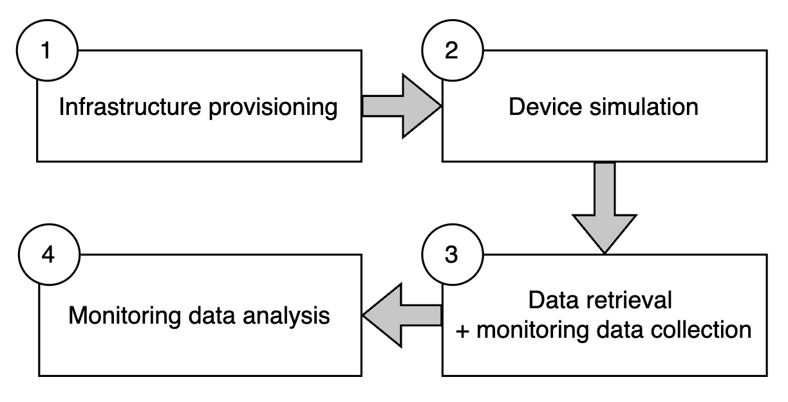

# AWS timeseries experiment
The experiment is conducted in the same order as subsections in this document.

The code in this repository was used to conduct experiment for **Comparative Analysis of Three IoT Data Storage
System Architectures on AWS Cloud**, the results of which were compiled into a research paper submitted for [ICSA 2025](https://conf.researchr.org/home/icsa-2025) conference.

## 1. Infrastructure provisioning
IaC code written in Terraform is located in [infrastructure](./infrastructure) directory.

The code can be used to provision an identical infrastructure setup as used in the experiment.

## 2. Data simulation
Python script for device simulation is located in [device_simulation](./device_simulation) directory.

## 3. Data retrieval
Python scripts used for data retrievals are located in [data_retrieval](./data_retrieval) directory.

## 4. Experiment analysis
Python scripts used to plot metrics collected during data retrieval are located in [analysis](./analysis) directory.

Document is work in progress!

## IoT device simulator
Source code located in [device_simulation](./device_simulation)
